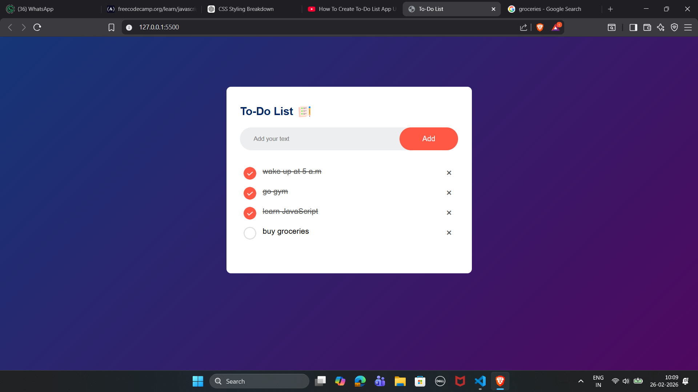

<h1 align="center">
   
  To-Do List Web App
</h1>

<p align="center">
  A simple, interactive and persistent task management web application built using HTML, CSS and JavaScript. This app allows users to add, complete, and delete tasks while automatically saving them in the browser using localStorage.
</p>

<p align="center">
  <!-- Tech Badges -->
  
  
  
  
</p>

---

## 📑 Table of Contents

- [🚀 Live Demo](#-live-demo)
- [🚀 Project Preview](#-project-preview)
- [📌 About The Project](#-about-the-project)
- [🛠️ Technologies Used](#️-technologies-used)
- [🧠 Core Concepts](#-core-concepts-practiced)
- [⚙️ How It Works](#️-how-it-works)
- [📂 Project Structure](#-project-structure)
- [🏗️ Installation](#️-installation--setup)
- [📜 License](#-license)
- [👨‍💻 Author](#-author)

---

## 🚀 Live Demo

👉 **Direct Link:** https://arnav-sirkhal.github.io/to-do-list-js/

---

## 🚀 Project Preview

<p align="center">
  
</p>

---

## 📌 About The Project

This project is a lightweight **To-Do List Web Application** that allows users to:

- ➕ Add new tasks
- ✅ Mark tasks as completed
- ❌ Delete tasks
- 💾 Save tasks permanently using browser `localStorage`

The application demonstrates strong fundamentals of DOM manipulation and event handling using pure JavaScript (no frameworks).

---

## 🛠️ Technologies Used

| Technology       | Description               | Official Documentation                                           |
| ---------------- | ------------------------- | ---------------------------------------------------------------- |
| HTML5            | Structure of the web page | https://developer.mozilla.org/en-US/docs/Web/HTML                |
| CSS3             | Styling and layout        | https://developer.mozilla.org/en-US/docs/Web/CSS                 |
| JavaScript (ES6) | Logic & Interactivity     | https://developer.mozilla.org/en-US/docs/Web/JavaScript          |
| Web Storage API  | Persistent data storage   | https://developer.mozilla.org/en-US/docs/Web/API/Web_Storage_API |

---

## 🧠 Core Concepts Practiced

- DOM Manipulation
- Event Delegation
- Dynamic Element Creation
- Local Storage API
- UI State Management

---

## ⚙️ How It Works

### ➕ Adding Tasks

- User enters text
- A new `<li>` element is created dynamically
- Task is appended to the list
- Data is stored in `localStorage`

### ✅ Completing Tasks

- Clicking on a task toggles a `checked` class
- CSS switches between:

```
images/unchecked.png
images/checked.png
```

### ❌ Deleting Tasks

- Clicking the ❌ removes the task
- Storage updates automatically

### 💾 Data Persistence

Tasks are saved using:

```javascript
localStorage.setItem("data", listContainer.innerHTML);
```

Restored on page load:

```javascript
listContainer.innerHTML = localStorage.getItem("data");
```

---

## 📂 Project Structure

```
To-Do-List/
│
├── images/
│   ├── checked.png
│   ├── icon.png
│   ├── screenshot.png
│   └── unchecked.png
│
├── index.html
├── style.css
├── script.js
└── README.md
```

---

## 🏗️ Installation & Setup

1️⃣ Clone the repository:

```bash
git clone https://github.com/Arnav-Sirkhal/to-do-list-js.git
```

2️⃣ Open the project folder.

3️⃣ Run `index.html` in your browser.

---

## 📜 License

This project is licensed under the MIT License.  
https://opensource.org/licenses/MIT

---

## 👨‍💻 Author

**Arnav Sirkhal**

GitHub: https://github.com/Arnav-Sirkhal

---

<p align="center">
  ⭐ If you like this project, consider starring the repository!
</p>
